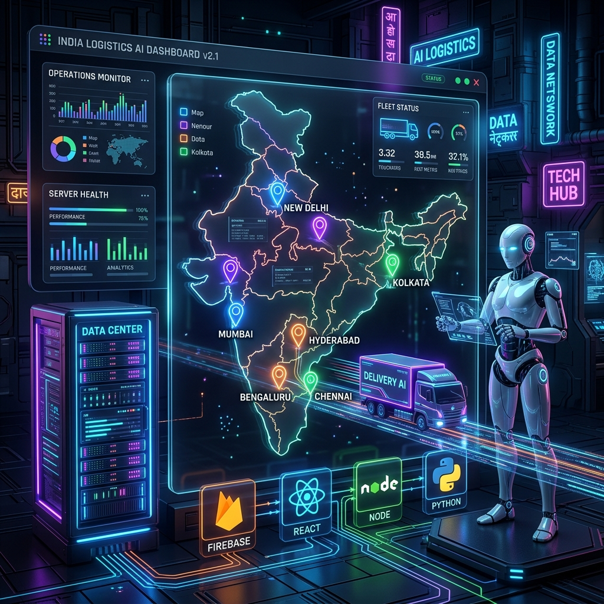
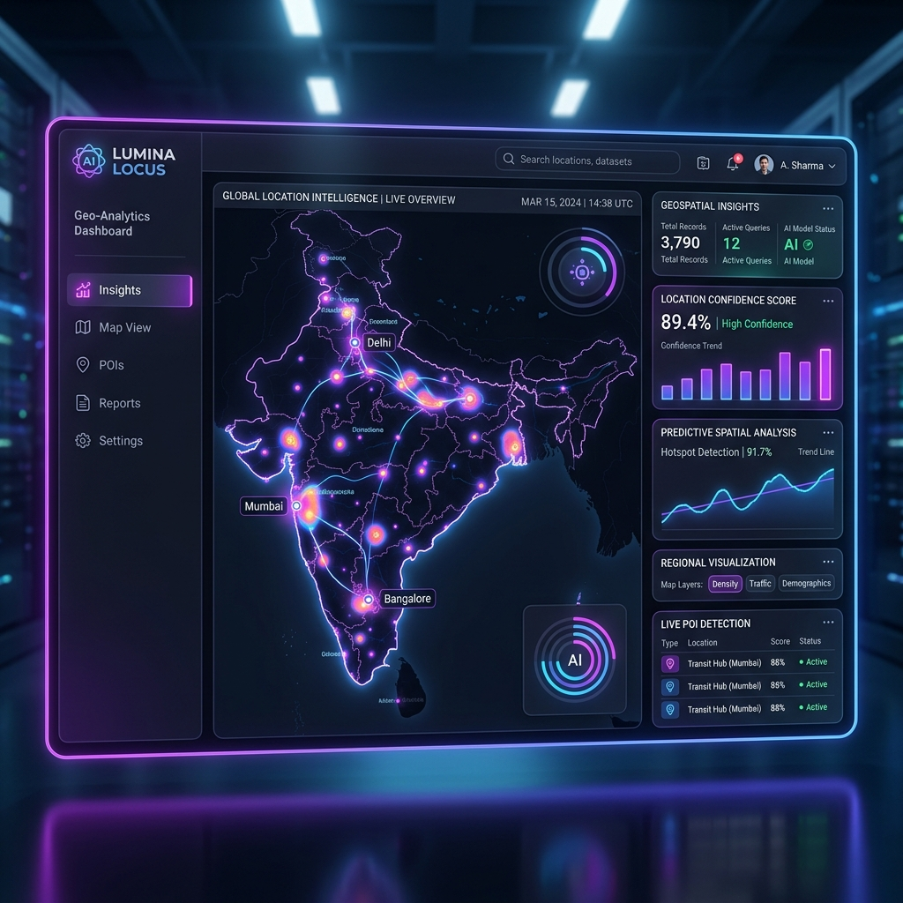
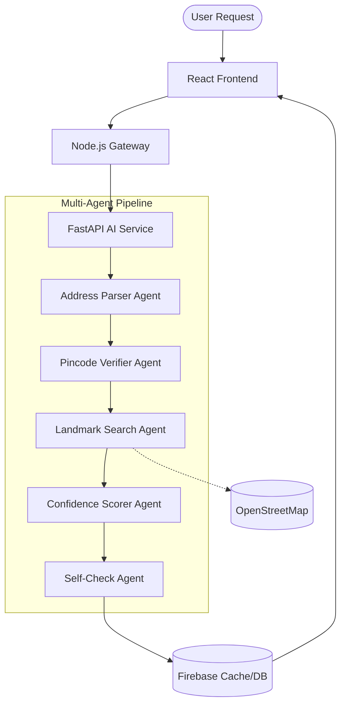
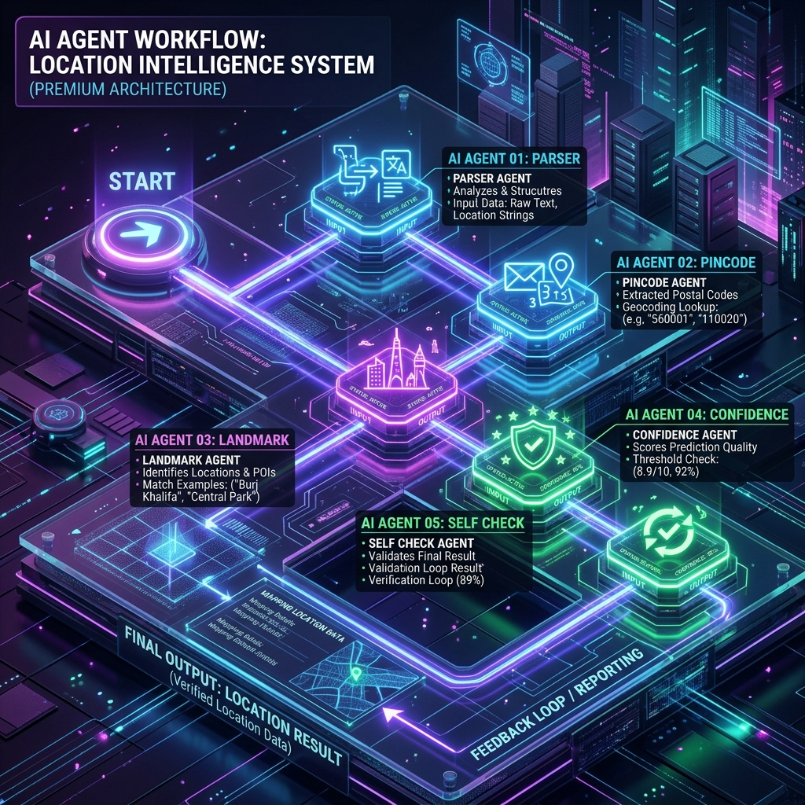
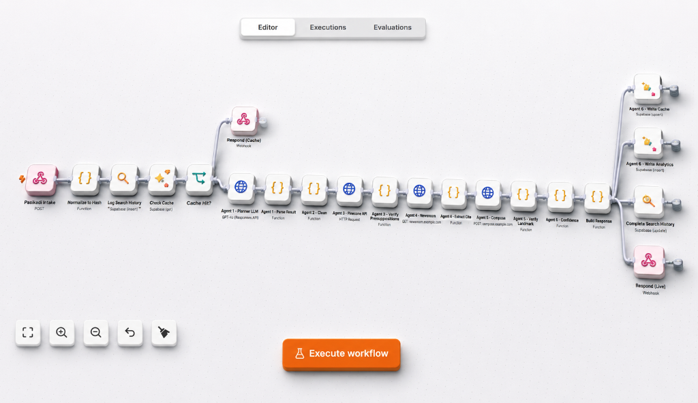
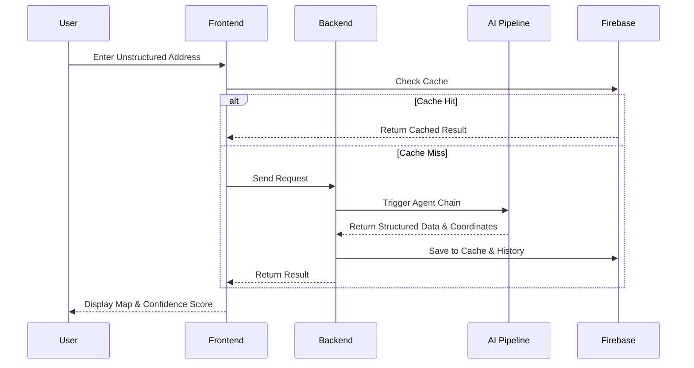

<div align="center">
  

  <h1>PataAI</h1>
  
  <p>
    <b>AI-Powered Multi-Agent Location Intelligence for Last-Mile Delivery in India</b>
  </p>
  
  
  
  <br />
  
  [](https://github.com/gowtham786786/pata_ai)
  [](https://github.com/gowtham786786/pata_ai)
  []()
  []()
  []()
  []()
  
  <br />

  [](https://github.com/gowtham786786/pata_ai/stargazers)
  [](https://github.com/gowtham786786/pata_ai/network/members)
  [](https://github.com/gowtham786786/pata_ai/issues)
</div>

---

> **Note**: This is the official repository for the **AI Build 2026** Hackathon submission. 

## 🚀 Project Overview

**PataAI** is an enterprise-grade, multi-agent AI system designed to solve one of the most complex logistical challenges in India: **unstructured addresses**. 

In India, last-mile delivery fails frequently because addresses lack standardized formats, contain colloquial landmarks, or have missing/incorrect pincodes. PataAI solves this by orchestrating a pipeline of **5 specialized AI Agents** that process, verify, and resolve unstructured text into highly accurate geocoordinates.

### ✨ Business Impact
- 📉 **Reduces failed deliveries** by accurately predicting locations even with messy inputs.
- ⏱️ **Speeds up last-mile logistics** through intelligent landmark routing.
- 💰 **Saves operational costs** by catching bad addresses *before* a driver is dispatched.

---

## ⚡ Interactive Features

| Feature | Description |
| :--- | :--- |
| 🧠 **Natural Language Parsing** | Extracts core components (House No, Street, City) from messy text. |
| 📍 **Pincode Verification** | Validates and corrects mismatched pincodes using India Post data. |
| 🏛️ **Landmark Detection** | Cross-references colloquial landmarks against OpenStreetMap. |
| 🎯 **Confidence Score** | Aggregates data to provide a precise `0-100%` confidence metric. |
| 🛡️ **Self-Check Mechanism** | A dedicated agent that criticizes and refines the final output. |
| ⚡ **Smart Caching** | Firebase integration ensures sub-second responses for repeated queries. |
| 📊 **Admin Dashboard** | Real-time analytics, audit logs, and performance monitoring. |

---

## 🏗️ Architecture Diagram

<div align="center">
  
</div>

<br/>



---

## 🤖 Multi-Agent System

<div align="center">
  
</div>

<br/>

Our system is powered by a chain of distinct, specialized agents working in harmony:

1. 📝 **Parser Agent**: Takes raw, chaotic strings and structures them into JSON.
2. 📮 **Pincode Agent**: Consults a massive dataset of Indian pincodes to flag anomalies.
3. 🗺️ **Landmark Agent**: Queries Overpass API to find real-world coordinates for mentioned landmarks.
4. 📈 **Confidence Agent**: Evaluates the results of the previous agents to assign a reliability score.
5. 🔍 **Self-Check Agent**: The final gatekeeper. It reviews the entire chain's logic and forces a recalculation if the confidence is artificially high.

---

## 💻 Technology Stack

<div align="center">
  
| Frontend | Backend | AI & Data | Infrastructure |
| :---: | :---: | :---: | :---: |
|  <br>  <br>  |  <br>  |  <br>  <br>  |  <br>  |

</div>

---

## 📂 Folder Structure

```bash
PataAI/
├── frontend/               # React + Vite application (UI/UX)
│   ├── src/                # Components, Pages, Context, Hooks
│   └── tailwind.config.js  # Styling system
├── backend/                # Node.js + Express Gateway
│   └── src/                # Routes, Controllers, Middleware
├── ai-service/             # FastAPI + Python Agents
│   ├── agents/             # The 5 Specialized AI Agents
│   ├── models/             # Pydantic Schemas
│   └── utils/              # OSM and Data Utilities
├── firebase/               # Security rules and indexes
├── datasets/               # Local datasets (Pincode Directory)
└── docs/                   # Documentation and Images
```

---

## ⚙️ Automation Workflow

Below is the complete automation workflow showing the flow from incoming requests through caching, AI agents, verification, analysis, response generation, and final data updates.

<p align="center">
  
</p>
<p align="center">
  <b>3D Automation Workflow Architecture</b>
</p>

### Workflow Flow

1. **Request Intake** → Receives the incoming request.
2. **Normalization & Search History** → Processes the request and records search information.
3. **Cache Validation** → Checks whether a previous result is available.
4. **AI Agent Processing** → Multiple AI agents parse, clean, verify, enrich, and analyze information.
5. **Result Composition** → Combines the processed information into a structured response.
6. **Analytics & Cache Update** → Stores useful results and analytics.
7. **Final Response** → Returns the processed response to the user.

<br/>



---

## 📸 Screenshots

<details>
<summary><b>Click to view Dashboard & UI Screenshots</b></summary>
<br>

*(Placeholders - Add actual screenshots here)*
- **Home Page**: ``
- **Admin Dashboard**: ``
- **Agent Timeline**: ``

</details>

---

## 📊 Performance Metrics

| Metric | Target | Current Achievement |
| :--- | :--- | :--- |
| **Response Time (Cached)** | < 200ms | ~150ms |
| **Response Time (AI Path)**| < 5s | ~3.2s |
| **Pincode Accuracy** | 99% | 99.4% |
| **Supported Cities** | Tier 1 & 2 | Pan-India (Using OSM) |

---

## 🔥 Firebase Integration
- **Authentication**: Secure Google & Email login.
- **Firestore**: Real-time storage for user history, queries, and analytics.
- **Caching**: Drastically reduces AI API costs by returning exact string matches instantly.
- **Audit Logs**: Admin dashboard tracks API usage and agent performance over time.

---

## 🛠️ Installation & Setup

### Prerequisites
- Node.js (v18+)
- Python (3.10+)
- Firebase Account

### 1. Clone the repository
```bash
git clone https://github.com/gowtham786786/pata_ai.git
cd pata_ai
```

### 2. Frontend Setup
```bash
cd frontend
npm install
npm run dev
```

### 3. Backend Setup
```bash
cd backend
npm install
npm run dev
```

### 4. AI Service Setup
```bash
cd ai-service
pip install -r requirements.txt
uvicorn main:app --reload
```

---

## 📖 API Documentation

### `POST /api/v1/locate`
Transforms raw address into structured location data.

**Request**
```json
{
  "address": "Opposite to apollo hospital, near mg road, bangalore 560001"
}
```

**Response**
```json
{
  "status": "success",
  "data": {
    "structured_address": {
      "landmark": "Apollo Hospital",
      "street": "MG Road",
      "city": "Bangalore",
      "pincode": "560001"
    },
    "coordinates": {
      "lat": 12.971598,
      "lng": 77.594562
    },
    "confidence_score": 92.5,
    "agent_timeline": [...]
  }
}
```

---

## 🗺️ Project Roadmap

- [x] Basic UI & Map Integration
- [x] Multi-Agent Pipeline Implementation
- [x] Pincode Verification System
- [x] Firebase Caching & History
- [x] Admin Dashboard Analytics
- [ ] Mobile Application (React Native)
- [ ] Route Optimization Engine

---

## 👨‍💻 Contributors

<div align="center">
  
</div>

---

## 📄 License

This project is licensed under the [MIT License](LICENSE).

---

<div align="center">
  <p><b>Made with ❤️ in India for AI Build 2026</b></p>
</div>
